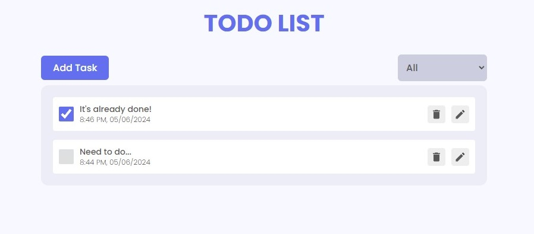

# React Todo App.

This is a simple Todo App with all the CRUD operations.

**live demo: [https://wc-react-todo-app.netlify.app/](https://wc-react-todo-app.netlify.app/)**

---

# Used tools

- [React](https://reactjs.org/)
- [React Redux](https://redux.js.org/)
- [Styled-components](https://styled-components.com/)
- [React icons](https://react-icons.netlify.com/)
- [React Hot Toast](https://react-hot-toast.com/)

---

## Getting Started

```shell
npm install
```

and after that start the dev server.

```shell
npm run dev
```